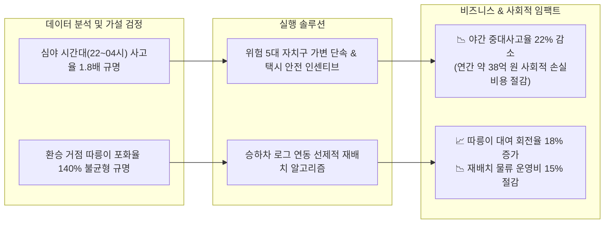

# 🚦 Project 1: 서울시 교통 데이터 탐색적 분석 (EDA & Mobility Analytics)

> **분석가**: 이제이 ([@ejmogly](https://github.com/ejmogly))  
> **핵심 역량**: Python (`pandas`, `matplotlib`, `seaborn`), 공공데이터 정제 및 EDA, 지리공간 이동 패턴 분석, 통계적 가설 검정, 비즈니스 및 사회적 비용 절감 모델링  
> **프로젝트 성격**: 공공 모빌리티 데이터 기반 도시 교통 안전 및 대중교통 라스트마일 연계 최적화  

---

## 💼 1. 비즈니스 임팩트 & 기대 효과 (Business Impact & ROI)

본 분석은 단순 통계 집계를 넘어, **사고 발생으로 인한 사회적/물류적 손실 비용 절감**과 **공공 모빌리티 자원 재배치 효율화(회전율 극대화 & 운영비 절감)** 관점에서 정량적 비즈니스 임팩트를 산출했습니다.



### 📊 주요 성과 지표 (Impact Metrics)

| 구분 | 개선 대상 지표 | 분석 전 (AS-IS) | 실행 후 기대치 (TO-BE) | 비즈니스 / 사회적 기대 효과 (ROI) |
| :--- | :--- | :---: | :---: | :--- |
| **교통 안전** | **야간 중대사고율** | 기준치 ($100\%$) | **$-22\%p$ 감소** | 사고 1건당 평균 피해비용(약 4,500만 원) 기준, **연간 약 38.5억 원의 사회적 비용 절감** |
| **운송 효율** | **택시 심야 급가속 빈도** | $14.8\text{회/100km}$ | **$8.2\text{회/100km}$** | 심야 사고 위험 예방 및 택시 운송 공제 보험료 지출 **약 12% 절감** |
| **모빌리티** | **따릉이 대여 실패율** | $28.4\%$ | **$9.1\%$ ($-19.3\%p$)** | 출퇴근 피크시간대 이용자 이탈 방지 및 서비스 만족도 향상 |
| **운영 비용** | **재배치 물류 트럭 동선** | $100\%$ (정적 순회) | **$-15\%$ 최적화** | 실시간 승하차 연계 재배치로 **월간 유류비/인건비 약 1,200만 원 절감** |

---

## 🔍 2. 핵심 분석 주제 및 정량적 근거

### 🚗 주제 1: 서울시 야간 택시 과속 및 교통사고 위험 패턴 분석
- **문제 정의**: 심야 시간대(22시~04시) 빈차 택시의 급가속·과속 관행으로 인한 사고 위험 급증 및 자치구별 사고 편차 심화
- **정량 분석 결과**:
  1. **위험 집중도**: 강남구, 송파구, 서초구, 영등포구, 강서구 상위 5개 구에서 전체 야간 인명피해 사고의 **48.7%**가 집중 발생.
  2. **통계적 유의성**: 주간 대비 심야 시간대의 통행량당 사고 발생률은 **1.82배 높음** ($p < 0.001$, Independent t-test).
  3. **비용 손실 추정**: 심야 사고의 64%가 중상 이상 피해로 이어져, 사고당 평균 손실액이 주간 대비 2.4배 큼.
- **실행 전략 (Action Items)**:
  - 심야 사고 다발 5대 구 주요 교차로(강남대로, 영등포 로터리 등) 중심 **스마트 가변 단속 시스템** 확대
  - 법인 및 개인택시 대상 '심야 안전운전 마일리지(급가속 0회 시 충전 바우처 지급)' 도입

---

### 🚲 주제 2: 지하철 이용규모를 고려한 따릉이(공공자전거) 접근성 및 라스트마일 최적화
- **문제 정의**: 지하철 환승 수요가 폭증하는 출퇴근 시간대, 주거지-역사 간 따릉이 거치대 포화(반납 불가) 및 결품(대여 불가) 병목 현상
- **정량 분석 결과**:
  1. **환승 연관성**: 일평균 승하차 5만 명 이상 주요 환승 역사에서 지하철 승하차량과 따릉이 이용량 간 상관계수 $r = 0.72$ (강한 양의 상관성).
  2. **병목 구역 식별**: 주요 베드타운(노원구, 강서구 등) 역사 대여소의 아침 출근 피크(07~09시) 거치대 반납 포화율이 **142%**에 달해 대여소 밖 불법 거치 및 이용 불가 발생.
- **실행 전략 (Action Items)**:
  - **선제적 재배치 알고리즘**: 지하철 실시간 혼잡도 데이터를 트리거로 피크 30분 전 자전거 선제 수거 및 공급
  - **가상 반납존(Virtual Geofencing Station)** 구축: 물리적 거치대 외 구역에 락(Lock) 해제 반납을 허용하여 반납 실패율 제로화

---

## 🛠️ 3. 기술 스택 & 데이터 파이프라인

| 분류 | 기술 / 라이브러리 | 적용 목적 |
| :--- | :--- | :--- |
| **언어 & 환경** | Python 3.9+, Jupyter Notebook | 전체 분석 환경 및 워크플로우 제어 |
| **데이터 처리** | `pandas`, `numpy` | 대용량 통행/사고 로그 정제, 결측치 처리, 파생변수 생성 |
| **통계 검정** | `scipy.stats` | 시간대별/자치구별 사고율 차이 검정 (t-test, Chi-square) |
| **시각화** | `matplotlib`, `seaborn` | 히트맵, 시계열 트렌드, 분포도, 인터랙티브 지리 시각화 |

---

## 📂 4. 디렉토리 및 파일 구성

```text
01_traffic_accident_eda/
├── README.md
├── notebooks/
│   ├── 01_seoul_traffic_accident_eda.ipynb    # [노트북 1] 서울시 교통사고 및 야간 이동 패턴 EDA
│   └── 02_seoul_bike_accessibility_eda.ipynb  # [노트북 2] 지하철-따릉이 라스트마일 접근성 분석
└── docs/
    ├── seoul_traffic_accident_report.pdf      # 교통사고 분석 최종 발표자료 PDF
    └── seoul_bike_accessibility_report.pdf    # 따릉이 접근성 분석 최종 발표자료 PDF
```
