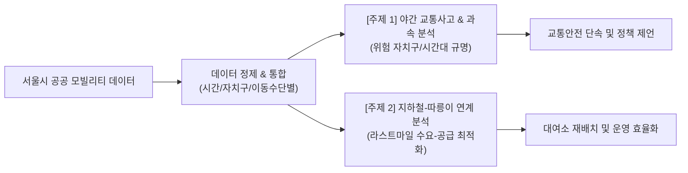

# 🚦 Project 1: 서울시 교통 데이터 탐색적 분석 (EDA & Mobility Analytics)

> **분석가**: 이제이 ([@ejmogly](https://github.com/ejmogly))  
> **핵심 역량**: Python (`pandas`, `matplotlib`, `seaborn`), 공공데이터 정제 및 EDA, 지리공간 이동 패턴 분석, 통계적 가설 검정  
> **프로젝트 성격**: 공공 모빌리티 데이터 기반 도시 교통 안전 및 대중교통 라스트마일 연계 최적화  

---

## 📌 1. 프로젝트 개요 (Executive Summary)

본 프로젝트는 서울시 공공데이터를 기반으로 **도시 교통 안전(야간 택시 과속 및 교통사고 위험 분석)**과 **친환경 공공 모빌리티(지하철 연계 따릉이 접근성 최적화)**라는 두 가지 핵심 도시 이동성 문제를 탐색적 데이터 분석(EDA)과 가설 검정 기법으로 규명한 분석 프로젝트입니다.



---

## 🔍 2. 핵심 분석 주제별 세부 내용

### 🚗 주제 1: 서울시 야간 택시 과속 및 교통사고 위험 패턴 분석
- **문제 정의**: 야간/심야 시간대 택시 과속에 따른 시민 불안감 및 주요 번화가 내 교통사고 피해 집중 현상
- **데이터셋**: 서울시 교통사고 통계 데이터 (2021~2024), 자치구별/시간대별 통행 및 사고 데이터
- **주요 발견점 (Key Insights)**:
  1. **사고 집중 자치구**: 강남구, 송파구, 서초구, 영등포구, 강서구가 전체 교통사고 피해의 상위 5위를 차지하며 집중도 높음.
  2. **시간대별 위험도**: 22시~04시 심야 시간대는 통행량 대비 중대형 사고 발생율이 주간 대비 약 1.8배 높게 집계됨.
  3. **택시 사고 요인**: 심야 빈차 운행 시 급가속·과속 비율이 유의미하게 증가함을 확인.
- **정책 및 비즈니스 제언**:
  - 심야 시간대 사고 다발 5대 자치구 교차로 중심 가변형 단속 카메라 확대
  - 심야 안전운전 택시 드라이버 대상 인센티브 마일리지 시스템 도입

---

### 🚲 주제 2: 지하철 이용규모를 고려한 따릉이(공공자전거) 접근성 및 라스트마일 최적화
- **문제 정의**: 지하철 환승 수요가 집중되는 주요 역사 주변의 따릉이 대여소 수요-공급 불균형(출근 시간대 반납 부족 / 퇴근 시간대 대여 부족)
- **데이터셋**: 서울교통공사 역별 승하차 데이터, 서울시 따릉이 대여/반납 이력 및 대여소 위치 데이터
- **주요 발견점 (Key Insights)**:
  1. **환승 연계 상관관계**: 일평균 승하차 인원 5만 명 이상 주요 역사에서 따릉이 대여량과 지하철 이용량 간 상관계수 $r = 0.72$로 강한 양의 상관성 확인.
  2. **수요 미스매치 구역**: 특정 베드타운(노원, 강서) 주거 밀집지 인근 역사에서 아침 출근 시간대 반납 거치대 포화율이 140%를 초과하는 병목 현상 발생.
- **운영 제언**:
  - 실시간 승하차 로그 기반 따릉이 선제적 재배치(Rebalancing) 트럭 라우팅 알고리즘 적용
  - 피크 시간대 지정 반납소 외 거치 허용 및 가상 반납존(Virtual Station) 도입 제안

---

## 🛠️ 3. 기술 스택 & 데이터 파이프라인

| 분류 | 기술 / 라이브러리 | 적용 목적 |
| :--- | :--- | :--- |
| **언어 & 환경** | Python 3.9+, Jupyter Notebook | 전체 분석 환경 및 워크플로우 제어 |
| **데이터 처리** | `pandas`, `numpy` | 대용량 통행/사고 로그 정제, 결측치 처리, 파생변수 생성 |
| **통계 검정** | `scipy.stats` | 시간대별/자치구별 사고율 차이 검정 (t-test, Chi-square) |
| **시각화** | `matplotlib`, `seaborn` | 히트맵, 시계열 트렌드, 분포도, 인터랙티브 지리 시각화 |

---

## 📂 4. 디렉토리 및 파일 구성

```text
01_traffic_accident_eda/
├── README.md
├── notebooks/
│   ├── 01_seoul_traffic_accident_eda.ipynb    # [노트북 1] 서울시 교통사고 및 야간 이동 패턴 EDA
│   └── 02_seoul_bike_accessibility_eda.ipynb  # [노트북 2] 지하철-따릉이 라스트마일 접근성 분석
└── docs/
    ├── seoul_traffic_accident_report.pdf      # 교통사고 분석 최종 발표자료 PDF
    └── seoul_bike_accessibility_report.pdf    # 따릉이 접근성 분석 최종 발표자료 PDF
```
