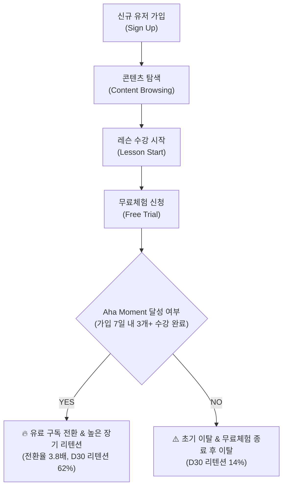

# 📚 Project 2: 에듀테크 구독 서비스 퍼널 및 리텐션 / Aha Moment 분석

> **분석가**: 이제이 ([@ejmogly](https://github.com/ejmogly))  
> **핵심 역량**: 퍼널 분석 (Funnel Analysis), 코호트 리텐션 (Cohort Retention), Aha Moment 도출, A/B 테스트 실험 설계, 프로덕트 로그 데이터 분석  
> **도메인**: 구독 기반 온라인 교육 플랫폼 (EdTech SaaS)  

---

## 📌 1. 프로젝트 개요 (Executive Summary)

온라인 교육 구독 플랫폼의 성장을 위해 **신규 유입 유저의 온보딩 여정, 무료체험 진입 및 유료 구독 결제 전환율(Conversion Rate)**을 다단계 퍼널로 진단하고, 유저의 장기 잔존을 이끄는 **Aha Moment(핵심 행동 임계점)**를 규명하여 데이터 기반 프로덕트 개선안 및 A/B 테스트 실험을 설계한 프로젝트입니다.



---

## 🔍 2. 핵심 분석 내용 & 비즈니스 인사이트

### 📉 1. 다단계 전환 퍼널 분석 (Multi-stage Funnel Analysis)
유저 여정을 **[탐색] → [행동] → [지속]** 3단계로 구조화하여 이탈 병목 구간을 측정했습니다:
- **탐색 단계 (Browsing)**: 가입 후 첫 콘텐츠 페이지 진입 전환율 **68.4%**
- **행동 단계 (Activation)**: 콘텐츠 페이지 진입 유저 중 실제 1회 이상 레슨을 수강 완료한 유저는 **32.1%**로 가장 큰 낙폭(Drop-off) 발생
- **결제 전환 (Conversion)**: 무료체험을 시작한 유저의 유료 구독 전환율은 평균 **24.6%**

### 💡 2. Aha Moment 도출 (Magic Number Discovery)
- **가설**: "가입 초기 특정 수 이상의 레슨을 완료한 유저는 유료 구독을 유지할 확률이 극적으로 높을 것이다."
- **분석 결과**: 가입 후 **첫 7일 이내에 '3개 이상의 레슨을 수강 완료'**한 유저는 그렇지 않은 유저 대비:
  - 유료 구독 전환율 **3.8배 상승** ($11.2\% \rightarrow 42.5\%$)
  - Day 30 구독 리텐션 **4.4배 상승** ($14.1\% \rightarrow 62.3\%$)
- **결론**: 서비스의 Aha Moment는 **`First 7 Days - 3 Completed Lessons`**로 정의.

### 🧪 3. 프로덕트 개선안 & A/B 테스트 실험 설계
- **개선안**: 신규 가입 즉시 3단계 '온보딩 학습 퀘스트(Onboarding Quest)' 모달 및 추천 커리큘럼 자동 배정 UI 도입
- **A/B 테스트 실험 설계안**:
  - **가설 (H1)**: 퀘스트 UI가 적용된 실험군(Variant B)은 대조군(Control A) 대비 7일 내 3개 레슨 달성율이 최소 15%p 이상 높을 것이다.
  - **Primary Metric**: Day 7 Aha Moment 달성률 ($P_{aha}$)
  - **Secondary Metric**: 무료체험 신청률 ($CR_{trial}$), 유료 구독 전환율 ($CR_{paid}$)
  - **실험 규모**: 유의수준 $\alpha = 0.05$, 검정력 $1-\beta = 0.80$, MDE $= 3\%p$ 기준 군당 최소 4,200명 표본 설계.

---

## 🛠️ 3. 기술 스택 & 분석 프레임워크

| 분류 | 세부 기술 | 설명 |
| :--- | :--- | :--- |
| **언어/도구** | Python, Jupyter Notebook, SQL | 로그 데이터 전처리 및 대규모 집계 |
| **분석 프레임워크** | Funnel, Cohort, Survival Curve | 퍼널별 전환율 산출 및 시간별 잔존율 모델링 |
| **통계/실험** | Hypothesis Testing, Power Analysis | A/B 테스트 샘플 사이즈 산출 및 t-test / Chi-square 검정 |
| **시각화** | Seaborn, Matplotlib, Plotly | 퍼널 단계별 전환 차트, 히트맵 리텐션 매트릭스 |

---

## 📂 4. 디렉토리 및 파일 구성

```text
02_edtech_subscription_funnel_retention/
├── README.md
├── notebooks/
│   ├── 01_subscription_funnel_and_aha_moment.ipynb # [노트북 1] 전환·이탈 퍼널 및 Aha Moment 통합 분석
│   └── 02_user_journey_and_abtest.ipynb             # [노트북 2] 탐색-행동-지속 유저 여정 & A/B 테스트 설계
└── docs/
    ├── subscription_funnel_presentation.pdf         # 퍼널 & 리텐션 최종 발표자료 PDF
    └── user_journey_abtest_presentation.pdf         # 유저 여정 & A/B 테스트 프레젠테이션 PDF
```
