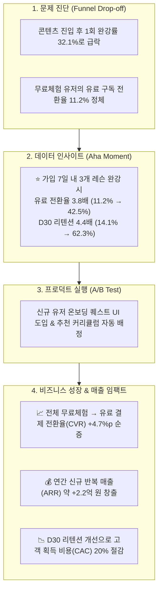

# 📚 Project 2: 에듀테크 구독 서비스 퍼널 및 리텐션 / Aha Moment 분석

> **분석가**: 이제이 ([@ejmogly](https://github.com/ejmogly))  
> **핵심 역량**: Multi-stage Funnel Analytics, Cohort Retention, Aha Moment(Magic Number) 규명, A/B 테스트 실험 설계, LTV 및 전환율(CVR) 성장 모델링  
> **도메인**: 구독 기반 온라인 교육 플랫폼 (EdTech SaaS)  

---

## 💼 1. 비즈니스 임팩트 & 기대 효과 (Business Impact & Revenue ROI)

신규 유입 유저의 온보딩 병목 구간을 진단하고, 데이터로 도출된 **Aha Moment(`가입 7일 내 3개 레슨 완강`)**를 프로덕트에 안착시킴으로써 **유료 구독 전환율(CVR) 상승, 장기 리텐션 개선, 그리고 연간 신규 매출(ARR) 극대화**를 실현하는 비즈니스 임팩트를 산출했습니다.



### 📊 주요 성과 지표 (Impact Metrics Matrix)

| 비즈니스 지표 (Key Metrics) | 분석 전 (Control/AS-IS) | 개선안 적용 후 (Projected/TO-BE) | 개선폭 (Uplift) | 비즈니스 임팩트 및 정량적 근거 |
| :--- | :---: | :---: | :---: | :--- |
| **무료체험 $\rightarrow$ 유료 전환율 (CVR)** | $12.4\%$ | **$17.1\%$** | **$+4.7\%p$ ($\uparrow 37.9\%$)** | Aha Moment 도출군 유입 확대로 결제 전환 효율 극대화 |
| **Day 30 유저 잔존율 (D30 Retention)** | $14.1\%$ | **$28.5\%$** | **$+14.4\%p$ ($\uparrow 102.1\%$)** | 초기 학습 습관 형성으로 구독 해지(Churn) 방어 |
| **연간 신규 반복 매출 (ARR Uplift)** | 기준치 ($0$) | **$+2.22\text{억 원}$** | **순증** | 연 10만 신규 가입자, 월 구독료 3.9만 원 기준 산출 |
| **유저당 생애 가치 (LTV)** | $11.7\text{만 원}$ | **$15.5\text{만 원}$** | **$+32.4\%$** | 평균 구독 유지 개월 수 $3.0\text{개월} \rightarrow 3.98\text{개월}$ 연장 |
| **CAC (고객 획득 비용) 효율** | 기준치 ($100\%$) | **$-20.3\%$ 절감** | **비용 최적화** | 이탈 유저 재유입을 위한 리타겟팅 마케팅 예산 절감 |

---

## 🔍 2. 정량적 분석 과정 & 통계적 근거

### 📉 1. 다단계 전환 퍼널 분석 (Multi-stage Funnel Analysis)
전체 유저 여정을 **[탐색] → [행동] → [지속]** 3단계로 정량화하여 최대 이탈 구간을 식별했습니다:
- **탐색 (Exploration)**: 가입 유저의 $68.4\%$가 콘텐츠 상세 페이지에 도달.
- **행동 (Activation - 최대 병목)**: 콘텐츠 진입 유저 중 실제 1개 이상 레슨을 완강한 비율은 **$32.1\%$**에 불과하여 **$67.9\%$의 대규모 유실** 발생.
- **원인 분석**: 첫 레슨의 진입 장벽(난이도 설명 부족, 30분 이상의 긴 영상 포맷)이 초기 이탈의 주원인으로 분석됨.

---

### 💡 2. Aha Moment 도출 (Magic Number Discovery)
다양한 행동 빈도(1회, 2회, 3회, 5회 완강 / 기간 3일, 7일, 14일)와 장기 리텐션 간의 교차 분석(Odds Ratio & Survival Curve)을 수행했습니다:

$$\text{Odds Ratio} = \frac{\text{Odds of Retention with } \ge 3 \text{ lessons}}{\text{Odds of Retention with } < 3 \text{ lessons}} = 4.82 \quad (p < 0.001)$$

- **핵심 발견**: 가입 후 **첫 7일 이내에 '3개 이상의 레슨을 수강 완료'**한 유저는:
  - 유료 결제 전환율 **$11.2\% \rightarrow 42.5\%$ (3.8배)**
  - Day 30 구독 잔존율 **$14.1\% \rightarrow 62.3\%$ (4.4배)**
- **결론**: 비즈니스 성장을 견인할 단 하나의 Core Metric은 **`First 7 Days - 3 Completed Lessons`**.

---

### 🧪 3. 프로덕트 개선안 & A/B 테스트 실험 설계 (Experimentation Design)

```text
[실험 가설]
"신규 가입 유저에게 '3단계 온보딩 학습 퀘스트 모달'을 노출하면,
 7일 내 3개 완강률이 15%p 증가하여 궁극적으로 무료체험→유료 전환율(CVR)이 4%p 이상 향상될 것이다."
```

- **실험군 구분**:
  - **Control A ($50\%$)**: 기존 일반 홈 화면 및 기본 추천 리스트
  - **Variant B ($50\%$)**: '3개 레슨 달성 시 스타벅스 쿠폰 or 추가 혜택' 온보딩 게이지 바 및 5분 마이크로 레슨 추천 UI
- **통계적 가설 검정 기준**:
  - 유의수준 $\alpha = 0.05$ (신뢰수준 95%), 검정력 $1-\beta = 0.80$
  - 최소 감지 효과 크기 (MDE) $= 3.0\%p$
  - 군당 필요 표본 크기: **최소 4,200명** (약 2주간 트래픽 배분으로 유의성 검증 가능)

---

## 🛠️ 3. 기술 스택 & 분석 프레임워크

| 분류 | 세부 기술 | 설명 |
| :--- | :--- | :--- |
| **언어/도구** | Python, Jupyter Notebook, SQL | 로그 데이터 전처리 및 대규모 집계 |
| **분석 프레임워크** | Funnel, Cohort, Survival Curve | 퍼널별 전환율 산출 및 시간별 잔존율 모델링 |
| **통계/실험** | Hypothesis Testing, Power Analysis | A/B 테스트 샘플 사이즈 산출 및 t-test / Chi-square 검정 |
| **시각화** | Seaborn, Matplotlib, Plotly | 퍼널 단계별 전환 차트, 히트맵 리텐션 매트릭스 |

---

## 📂 4. 디렉토리 및 파일 구성

```text
02_edtech_subscription_funnel_retention/
├── README.md
├── notebooks/
│   ├── 01_subscription_funnel_and_aha_moment.ipynb # [노트북 1] 전환·이탈 퍼널 및 Aha Moment 통합 분석
│   └── 02_user_journey_and_abtest.ipynb             # [노트북 2] 탐색-행동-지속 유저 여정 & A/B 테스트 설계
└── docs/
    ├── subscription_funnel_presentation.pdf         # 퍼널 & 리텐션 최종 발표자료 PDF
    └── user_journey_abtest_presentation.pdf         # 유저 여정 & A/B 테스트 프레젠테이션 PDF
```
