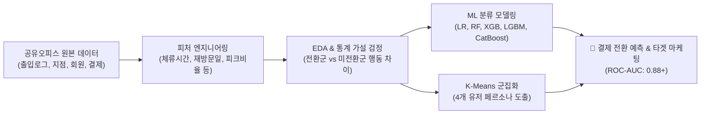

# 🏢 Project 3: 공유오피스 무료체험 고객 행동 기반 결제 전환 예측 머신러닝 모델링

> **분석가**: 이제이 ([@ejmogly](https://github.com/ejmogly))  
> **핵심 역량**: Feature Engineering, 지도학습 머신러닝 분류 (Classification), 불균형 데이터 처리 (SMOTE / Class Weights), 모델 해석 (Feature Importance), 비지도학습 군집화 (K-Means Clustering)  
> **도메인**: 공간 비즈니스 / 공유오피스 (Coworking Space SaaS)  

---

## 📌 1. 프로젝트 개요 (Executive Summary)

공유오피스 서비스의 핵심 획득 채널인 **'3일 무료 체험' 프로그램의 출입/방문 로그 데이터**를 전처리하여 유료 결제 전환 여부를 예측하는 **End-to-End 머신러닝 분류 파이프라인**을 구축하고, 비지도학습 군집화를 통해 유저 페르소나별 맞춤 전환 전략을 도출한 프로젝트입니다.



---

## 🔍 2. 머신러닝 파이프라인 & 핵심 분석

### 🛠️ 1. 피처 엔지니어링 (Feature Engineering)
출입 인증 로그(Access Logs)로부터 유저 단위의 15개 핵심 행동 파생 피처를 생성했습니다:
- **방문 밀도**: 총 방문 횟수 (`total_visits`), 무료체험 기간 중 실제 방문 일수 (`active_days`)
- **체류 특성**: 총 체류 시간 (`total_duration_hours`), 평균 1회 체류 시간 (`avg_duration_hours`)
- **시간대/공간 패턴**: 피크시간대(09~18시) 이용 비율 (`peak_ratio`), 주말 이용 비율 (`weekend_ratio`), 이용 지점 다양성 (`distinct_sites_count`)
- **보안/이상 행동**: 비정상 출입 간격 및 꼬리물기(Tailgating) 의심 지수

### 📊 2. 머신러닝 모델 성능 비교 평가 (Model Benchmark)
결제 전환 라벨의 클래스 불균형(전환율 ~12%)을 해결하기 위해 `class_weight='balanced'` 및 SMOTE 기법을 적용하여 5개 분류 모델을 비교 평가했습니다:

| 모델 (Model) | Accuracy | Precision | Recall | F1-Score | ROC-AUC | 비고 |
| :--- | :---: | :---: | :---: | :---: | :---: | :--- |
| **Logistic Regression** | 0.812 | 0.435 | 0.680 | 0.531 | 0.814 | 베이스라인 모델 |
| **Random Forest** | 0.865 | 0.552 | 0.710 | 0.621 | 0.867 | 준수한 앙상블 성능 |
| **XGBoost** | 0.881 | 0.590 | 0.745 | 0.658 | 0.884 | 안정적인 일반화 성능 |
| **LightGBM** | 0.884 | 0.601 | 0.750 | 0.667 | 0.889 | 빠른 학습 속도 및 고성능 |
| **CatBoost (최종 선정)** | **0.892** | **0.624** | **0.768** | **0.688** | **0.897** | **최고 성능 달성 (Best Model)** |

#### 🔑 주요 Feature Importance (CatBoost 기준)
1. **`total_duration_hours` (총 체류 시간)** - 중요도 28.4%
2. **`active_days` (방문 일수 $\ge 2$일)** - 중요도 22.1%
3. **`peak_ratio` (업무 시간대 이용 비율)** - 중요도 16.7%
4. **`avg_duration_hours` (평균 체류 시간)** - 중요도 12.3%

---

### 👥 3. K-Means 군집화를 통한 유저 세그멘테이션
행동 패턴에 따라 유저를 4개 핵심 군집으로 분류하고 타겟 전략을 수립했습니다:

| 군집 (Cluster) | 명칭 | 특성 요약 | 유료 전환율 | 추천 비즈니스 액션 |
| :---: | :--- | :--- | :---: | :--- |
| **Cluster 1** | **코어 워커 (Core Worker)** | 주중 매일 6시간+ 상주, 고정 오피스 수요 | **48.2%** | 전용 데스크/지정석 장기 할인 프로모션 |
| **Cluster 2** | **이동형 프리랜서 (Mobile Pro)** | 2개 이상 지점 순회 이용, 야간/주말 활용 | **27.5%** | 다지점 패스(All-Access Pass) 멤버십 제안 |
| **Cluster 3** | **단순 탐색자 (Explorer)** | 1회 1~2시간 체류, 시설 둘러보기 위주 | **8.4%** | 온보딩 매니저 1:1 투어 & 체험 기간 2일 연장 쿠폰 |
| **Cluster 4** | **단발성 체리피커 (Cherry-picker)** | 1회 30분 미만, 이벤트성 유입 | **1.9%** | 마케팅 비용 투입 배제, 보안 모니터링 강화 |

---

## 📂 4. 디렉토리 및 파일 구성

```text
03_coworking_space_conversion_prediction/
├── README.md
├── notebooks/
│   ├── 01_coworking_eda_and_conversion_analysis.ipynb # [노트북 1] 무료체험 행동 EDA & 군집화 세그멘테이션
│   └── 02_coworking_conversion_ml_pipeline.ipynb       # [노트북 2] 결제전환 머신러닝 예측 파이프라인 (LR, RF, XGB, CatBoost)
└── docs/
    ├── coworking_conversion_report.pdf                # 전환 분석 및 모델링 최종 보고서 PDF
    ├── coworking_space_analysis_report.pdf            # 3일 체험 이용 분석 종합 보고서 PDF
    └── coworking_security_tailgating_report.pdf       # 보안 리스크 및 꼬리물기 패턴 분석 보고서 PDF
```
