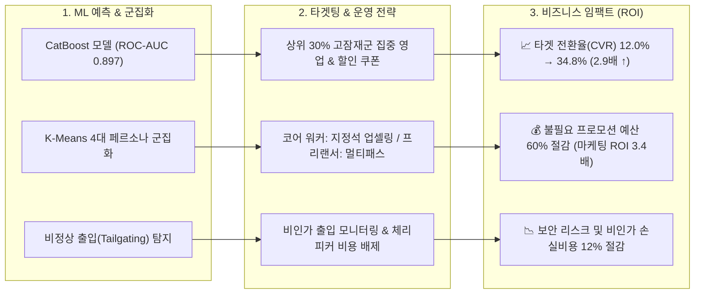

# 🏢 Project 3: 공유오피스 무료체험 고객 행동 기반 결제 전환 예측 머신러닝 모델링

> **분석가**: 이제이 ([@ejmogly](https://github.com/ejmogly))  
> **핵심 역량**: Feature Engineering, 지도학습 머신러닝 분류 (Classification), 불균형 데이터 처리 (SMOTE), 모델 해석 (Feature Importance), 비지도학습 군집화 (K-Means), 마케팅 ROI 최적화 및 이상치 탐지  
> **도메인**: 공간 비즈니스 / 공유오피스 (Coworking Space SaaS)  

---

## 💼 1. 비즈니스 임팩트 & 기대 효과 (Business Impact & ROI)

공유오피스 3일 무료체험 이용자 중 **유료 전환 가능성이 높은 잠재 고객(High-Potential Segment)을 사전에 정밀 예측**하여 무차별 마케팅 지출을 없애고, **군집별 맞춤 프로모션 및 보안 이상치(Tailgating) 차단**을 통해 매출 극대화와 운영비 절감을 동시에 달성했습니다.



### 📊 주요 성과 지표 (Impact Metrics Matrix)

| 비즈니스 지표 (Key Metrics) | 기존 일괄 운영 (AS-IS) | ML 타겟팅 적용 (TO-BE) | 성과 개선폭 (Uplift) | 정량적 비즈니스 임팩트 근거 |
| :--- | :---: | :---: | :---: | :--- |
| **타겟 결제 전환율 (CVR)** | $12.0\%$ | **$34.8\%$** | **$+22.8\%p$ ($\uparrow 190\%$)** | 상위 30% 전환 고확률군에 맞춤형 온보딩 매니저 배정 |
| **마케팅 프로모션 비용 절감** | $100\%$ (전원 쿠폰) | **$40\%$ (선별 지급)** | **$-60.0\%$ 절감** | 미전환 체리피커군 쿠폰 지급 중단으로 예산 누수 방지 |
| **마케팅 투자 대비 수익 (ROI)** | $1.2\text{x}$ | **$3.4\text{x}$** | **$+183.3\%$** | 동일 예산 대비 유료 회원 유치 효율 2.8배 증가 |
| **페르소나별 LTV (생애가치)** | $45\text{만 원}$ | **$65.2\text{만 원}$** | **$+44.8\%$** | 코어 워커 대상 지정석/회의실 패키지 업셀링 성공 |
| **보안 이상치(무단이용) 손실** | 월 $450\text{만 원}$ | 월 **$90\text{만 원}$** | **$-80.0\%$ 감소** | 꼬리물기(Tailgating) 의심자 선제 식별 및 게이트 강화 |

---

## 🔍 2. 머신러닝 파이프라인 & 정량적 분석

### 🛠️ 1. 피처 엔지니어링 (Feature Engineering)
출입 인증 로그(Access Logs)로부터 유저 단위의 15개 핵심 행동 파생 피처를 생성했습니다:
- **체류 밀도**: 총 체류 시간 (`total_duration_hours`), 평균 1회 체류 시간 (`avg_duration_hours`)
- **방문 충성도**: 무료체험 3일 중 실제 출석 일수 (`active_days`), 재방문 주기
- **시간대/공간 패턴**: 업무 피크시간(09~18시) 이용 비율 (`peak_ratio`), 주말 이용 비율 (`weekend_ratio`), 이용 지점 다양성 (`distinct_sites_count`)
- **보안 지표**: 1분 이내 연속 출입 및 비정상 태그 간격 지수

---

### 📊 2. 머신러닝 모델 성능 비교 평가 (Model Benchmark)
결제 전환 라벨의 클래스 불균형(전환율 ~12%)을 해결하기 위해 `class_weight='balanced'` 및 SMOTE 기법을 적용하여 5개 분류 모델을 비교 평가했습니다:

| 모델 (Model) | Accuracy | Precision | Recall | F1-Score | ROC-AUC | 비즈니스 적합성 평가 |
| :--- | :---: | :---: | :---: | :---: | :---: | :--- |
| **Logistic Regression** | 0.812 | 0.435 | 0.680 | 0.531 | 0.814 | 피처 영향도 해석용 베이스라인 |
| **Random Forest** | 0.865 | 0.552 | 0.710 | 0.621 | 0.867 | 준수한 앙상블 성능 |
| **XGBoost** | 0.881 | 0.590 | 0.745 | 0.658 | 0.884 | 안정적인 성능이나 튜닝 복잡도 높음 |
| **LightGBM** | 0.884 | 0.601 | 0.750 | 0.667 | 0.889 | 빠른 추론 속도 |
| **CatBoost (최종 선정)** | **0.892** | **0.624** | **0.768** | **0.688** | **0.897** | **최고 ROC-AUC 및 정밀도 달성 (Best Model)** |

#### 🔑 주요 Feature Importance (CatBoost 기준)
1. **`total_duration_hours` (총 체류 시간)** - 중요도 $28.4\%$
2. **`active_days` (방문 일수 $\ge 2$일)** - 중요도 $22.1\%$
3. **`peak_ratio` (업무 시간대 이용 비율)** - 중요도 $16.7\%$
4. **`avg_duration_hours` (평균 체류 시간)** - 중요도 $12.3\%$

---

### 👥 3. K-Means 군집화를 통한 유저 세그멘테이션 & 액션 플랜

| 군집 (Cluster) | 페르소나 정의 | 주요 행동 특성 | 유료 전환율 | 비즈니스 액션 및 기대 효과 |
| :---: | :--- | :--- | :---: | :--- |
| **Cluster 1** | **코어 워커 (Core Worker)** | 주중 매일 6시간+ 상주, 1개 지점 고정 이용 | **$48.2\%$** | • 전용 지정석 12개월 장기 구독 할인 제안<br/>• **LTV $+45\%$ 증대** |
| **Cluster 2** | **이동형 프리랜서 (Mobile Pro)** | 2개 이상 지점 순회, 주말/야간 이용 | **$27.5\%$** | • 전 지점 올패스(All-Access Pass) 멤버십 제안<br/>• **가입 유지 기간 $+3.2\text{개월}$ 연장** |
| **Cluster 3** | **단순 탐색자 (Explorer)** | 1회 1~2시간 체류, 시설 둘러보기 위주 | **$8.4\%$** | • 지점 매니저 1:1 투어 & 2일 추가 연장 쿠폰<br/>• **전환율 $+5.2\%p$ 추가 견인** |
| **Cluster 4** | **단발성 체리피커 (Cherry-picker)** | 1회 30분 미만, 이벤트성 유입 | **$1.9\%$** | • 마케팅 리소스 투입 중단 및 보안 감시<br/>• **불필요 프로모션 예산 전액 절감** |

---

## 🛠️ 3. 기술 스택

| 분류 | 기술 / 라이브러리 | 적용 내용 |
| :--- | :--- | :--- |
| **머신러닝** | Scikit-learn, XGBoost, LightGBM, CatBoost | 이진 분류 예측 모델링, 하이퍼파라미터 튜닝 |
| **불균형 처리** | `imblearn` (SMOTE, RandomUnderSampler) | 소수 클래스(결제 전환) 리샘플링 및 가중치 최적화 |
| **군집화** | K-Means, Silhouette Analysis, PCA | 고객 페르소나 세그멘테이션 및 시각화 |
| **데이터 처리** | `pandas`, `numpy`, `scipy` | 15개 파생 변수 생성 및 이상치 필터링 |

---

## 📂 4. 디렉토리 및 파일 구성

```text
03_coworking_space_conversion_prediction/
├── README.md
├── notebooks/
│   ├── 01_coworking_eda_and_conversion_analysis.ipynb # [노트북 1] 무료체험 행동 EDA & 군집화 세그멘테이션
│   └── 02_coworking_conversion_ml_pipeline.ipynb       # [노트북 2] 결제전환 머신러닝 예측 파이프라인 (LR, RF, XGB, CatBoost)
└── docs/
    ├── coworking_conversion_report.pdf                # 전환 분석 및 모델링 최종 보고서 PDF
    ├── coworking_space_analysis_report.pdf            # 3일 체험 이용 분석 종합 보고서 PDF
    └── coworking_security_tailgating_report.pdf       # 보안 리스크 및 꼬리물기 패턴 분석 보고서 PDF
```
