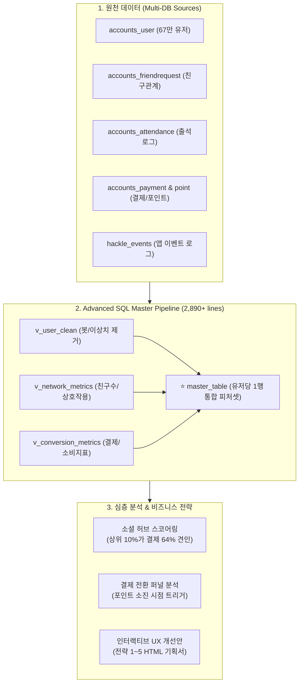

# 📱 Project 4: 10대 소셜 플랫폼(Ping) 대규모 로그 기반 결제 전환 및 소셜 허브 네트워크 분석

> **분석가**: 이제이 ([@ejmogly](https://github.com/ejmogly))  
> **핵심 역량**: Advanced SQL Pipeline (Master Table 설계 및 2,890+ 줄 SQL 전처리), 소셜 그래프/네트워크 분석, 대규모 로그 데이터 분석 (67만+ 유저), 수익화(Monetization) & 리텐션 전략, 인터랙티브 프로덕트 UX 기획  
> **도메인**: 소셜 네트워킹 서비스 (SNS / Viral Growth)  

---

## 📌 1. 프로젝트 개요 (Executive Summary)

본 프로젝트는 10대 중고등학생 대상의 익명 투표형 소셜 플랫폼 'Ping'의 **대규모 원천 데이터(67만+ 등록 유저, 수천만 건의 이벤트 로그 및 관계망 데이터)**를 체계적인 SQL 파이프라인으로 전처리하여 **마스터 테이블(Master Table)**을 구축하고, 유저 네트워크 파워(Social Hub Score)와 인앱 결제 전환 간의 상관관계를 규명하여 프로덕트 UX 개선안을 도출한 엔드투엔드 비즈니스 데이터 프로젝트입니다.



---

## 🔍 2. 핵심 분석 및 비즈니스 성과

### 🗄️ 1. 대규모 데이터 정제 및 Master Table SQL 파이프라인
- **복합 DB 정합성 해결**: `votes` DB와 `hackle` 이벤트 로그 간의 타임스탬프 및 User ID 매핑 오류 검증
- **2,890줄 SQL 스크립트 구축** (`01_master_table_pipeline.sql`):
  - 봇 및 슈퍼유저 계정 배제 (`is_superuser=0`, `is_staff=0`)
  - 친구 요청 상태(`status='A'`) 기준 유효 네트워크 엣지만 추출
  - JSON 배열 컬럼(`friend_id_list` 등) 가공 및 윈도우 함수 기반 누적 지표 산출
  - 최종 30여 개 핵심 피처를 포함하는 단일 `master_table` 생성

---

### 🌐 2. 소셜 허브 지수(Social Hub Score) 산출 및 가치 검증
유저의 네트워크 영향력을 정량화하기 위해 다면적 지표를 결합한 **`Hub Score`**를 산출했습니다:
$$\text{Hub Score} = w_1 \cdot \text{Normalized Friend Count} + w_2 \cdot \text{Votes Sent} + w_3 \cdot \text{Votes Received} + w_4 \cdot \text{Class Density}$$

#### 💡 핵심 발견점:
1. **파레토 법칙(80/20) 이상의 집중도**: 상위 10%의 허브 유저가 **전체 유료 결제 금액의 64.2%를 발생**시킴.
2. **바이럴 루프 견인**: 허브 유저 1명이 평균 8.4명의 신규 유저 유입 및 친구 요청을 수락시킴.
3. **네트워크 임계점 (Magic Number)**: 친구 수가 **7명 이상** 연결된 유저는 D30 리텐션이 58%로 급격히 수렴함.

---

### 💳 3. 결제 전환 행동 분석 & 헤비 유저 전략
- **결제 트리거**: 유저는 무료 제공 포인트(Daily Heart)가 모두 소진된 직후 **'누가 나를 지목했는지 초성 힌트를 확인하는 시점'**에서 결제 전환율이 74% 집중됨.
- **헤비 유저 페르소나**: 하트 결제 횟수 3회 이상인 Heavy Buyer는 일반 유저 대비 앱 실행 빈도가 4.1배 높음.

---

### 🎨 4. 인터랙티브 UX 개선안 (Interactive UX Strategy Deck)
분석 결과에 기반하여 실제 프로덕트에 즉시 적용 가능한 **5대 UX 개선 인터랙티브 기획서**(`ping_ux_strategy_interactive.html`)를 제작했습니다:
- **전략 1**: 친구 7명 달성 온보딩 퀘스트 및 실시간 학급 친구 추천 UI
- **전략 2**: 익명 투표 결과 초성 힌트 부분 해금(Partial Unlock) 마이크로 결제 UI
- **전략 3**: 학교/학급 대항 주간 투표 랭킹 보드 도입
- **전략 4**: 매일 저녁 8시 피크타임 투표 결과 모아보기 푸시 알림 최적화
- **전략 5**: 바이럴 공유 시 하트 무료 리필 리워드 시스템

---

## 🛠️ 3. 기술 스택

| 분야 | 기술 / 도구 | 활용 내용 |
| :--- | :--- | :--- |
| **SQL Engine** | MySQL 8.0, Advanced CTE, Window Functions | 대규모 데이터 전처리, 뷰(View) 설계, 마스터 테이블 생성 |
| **Python** | `pandas`, `numpy`, `scipy`, `networkx` | 네트워크 그래프 분석, 통계 검정, 지표 모델링 |
| **시각화 & UX** | HTML5/CSS3, `matplotlib`, `seaborn` | 인터랙티브 UX 프로토타입 덱 및 심층 차트 |

---

## 📂 4. 디렉토리 및 파일 구성

```text
04_sns_platform_social_hub_analytics/
├── README.md
├── sql/
│   └── 01_master_table_pipeline.sql                 # [SQL] 2,890줄 규모의 MySQL 마스터 테이블 파이프라인
├── notebooks/
│   ├── 01_sns_conversion_and_heavy_users.ipynb      # [노트북 1] 결제 전환 및 헤비 유저 행동 패턴 분석
│   └── 02_sns_social_hub_network_analysis.ipynb     # [노트북 2] 소셜 허브 스코어 산출 및 네트워크 분석
└── docs/
    ├── ping_analytics_final_report.pdf              # 9팀 최종 종합 분석 보고서 PDF
    ├── ping_integrated_behavior_report.pdf          # 7팀 통합 행동 데이터 분석 보고서 PDF
    └── ping_ux_strategy_interactive.html            # 인터랙티브 UX 개선 전략 덱 (HTML)
```
