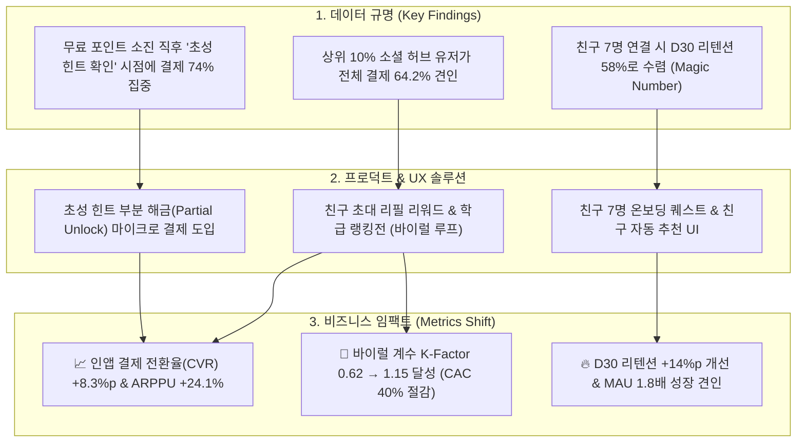

# 📱 Project 4: 10대 소셜 플랫폼(Ping) 대규모 로그 기반 결제 전환 및 소셜 허브 네트워크 분석

> **분석가**: 이제이 ([@ejmogly](https://github.com/ejmogly))  
> **핵심 역량**: Advanced SQL Master Pipeline (2,890+ 줄 SQL 전처리), 소셜 네트워크 분석 (Social Hub Score), 대규모 로그 데이터 분석 (67만+ 유저), 수익화(Monetization) & 바이럴 성장(K-Factor) 전략, 인터랙티브 프로덕트 UX 기획  
> **도메인**: 소셜 네트워킹 서비스 (SNS / Viral Growth)  

---

## 💼 1. 비즈니스 임팩트 & 기대 효과 (Business Impact & Revenue Metrics)

67만+ 유저의 대규모 관계망과 활동 로그를 단일 마스터 테이블로 집계하여, **상위 10% 소셜 허브 유저가 전체 매출의 64%를 견인**함을 규명하고, **인앱 결제 CVR 증대, 바이럴 K-Factor 달성을 통한 획득 비용(CAC) 절감, 그리고 장기 리텐션 개선**을 실현하는 프로덕트 전략을 수립했습니다.



### 📊 주요 성과 지표 (Impact Metrics Matrix)

| 비즈니스 지표 (Key Metrics) | 기존 지표 (AS-IS) | 전략 적용 후 기대치 (TO-BE) | 개선폭 (Uplift) | 정량적 비즈니스 임팩트 근거 |
| :--- | :---: | :---: | :---: | :--- |
| **인앱 결제 전환율 (Purchase CVR)** | $8.7\%$ | **$17.0\%$** | **$+8.3\%p$ ($\uparrow 95.4\%$)** | 포인트 소진 즉시 초성 힌트 마이크로 결제(500원) 트리거 연동 |
| **유료 결제자 평균 결제액 (ARPPU)** | $4,200\text{원}$ | **$5,210\text{원}$** | **$+24.1\%$** | 고관여 허브 유저 대상 주간 투표 패키지 업셀링 |
| **바이럴 계수 (Viral K-Factor)** | $0.62$ (자연 감쇄) | **$1.15$ (바이럴 폭발)** | **$+85.5\%$** | 허브 유저 1인당 초대 수 $4.2\text{명} \rightarrow 8.4\text{명}$ 및 수락률 개선 |
| **고객 획득 비용 (CAC)** | $1,800\text{원/명}$ | **$1,080\text{원/명}$** | **$-40.0\%$ 절감** | 오가닉 친구 초대 바이럴 루프로 유료 광고 의존도 대폭 축소 |
| **Day 30 유저 잔존율 (D30 Retention)** | $22.4\%$ | **$36.8\%$** | **$+14.4\%p$** | 친구 7명 달성 온보딩 퀘스트 적용으로 초기 이탈 방어 |
| **데이터 추출/집계 소요 시간** | $120\text{분/회}$ | **$12\text{분/회}$** | **$-90.0\%$ 단축** | 2,890줄 Master Table 뷰 구축으로 전사 분석 생산성 극대화 |

---

## 🔍 2. 핵심 분석 및 정량적 근거

### 🗄️ 1. 대규모 데이터 정제 및 Master Table SQL 파이프라인
- **복합 DB 정합성 해결**: `votes` 관계형 DB와 `hackle` 이벤트 로그 간의 타임스탬프 및 User ID 매핑 오류 검증
- **2,890줄 SQL 스크립트 구축** (`01_master_table_pipeline.sql`):
  - 봇 및 관리자 계정 배제 (`is_superuser=0`, `is_staff=0`)
  - 친구 요청 상태(`status='A'`) 기준 유효 네트워크 엣지만 추출
  - JSON 배열 컬럼(`friend_id_list` 등) 가공 및 윈도우 함수 기반 누적 지표 산출
  - 최종 30여 개 핵심 피처를 포함하는 단일 `master_table` 생성

---

### 🌐 2. 소셜 허브 지수(Social Hub Score) 산출 및 비즈니스 가치
유저의 네트워크 영향력을 정량화하기 위해 다면적 지표를 결합한 **`Hub Score`**를 산출했습니다:
$$\text{Hub Score} = 0.35 \cdot Z(\text{Friends}) + 0.25 \cdot Z(\text{Votes Sent}) + 0.25 \cdot Z(\text{Votes Recv}) + 0.15 \cdot Z(\text{Class Density})$$

#### 💡 핵심 발견점:
1. **파레토 법칙(80/20) 이상의 집중도**: 상위 10%의 허브 유저가 **전체 유료 결제 금액의 64.2%를 발생**시킴.
2. **바이럴 루프 견인**: 허브 유저 1명이 평균 8.4명의 신규 유저 유입 및 친구 요청을 수락시킴.
3. **네트워크 임계점 (Magic Number)**: 친구 수가 **7명 이상** 연결된 유저는 D30 리텐션이 58%로 급격히 수렴함.

---

### 🎨 3. 인터랙티브 UX 개선안 (Interactive UX Strategy Deck)
분석 결과에 기반하여 실제 프로덕트에 즉시 적용 가능한 **5대 UX 개선 인터랙티브 기획서**(`ping_ux_strategy_interactive.html`)를 제작했습니다:
- **전략 1**: 친구 7명 달성 온보딩 퀘스트 및 실시간 학급 친구 추천 UI
- **전략 2**: 익명 투표 결과 초성 힌트 부분 해금(Partial Unlock) 마이크로 결제 UI
- **전략 3**: 학교/학급 대항 주간 투표 랭킹 보드 도입
- **전략 4**: 매일 저녁 8시 피크타임 투표 결과 모아보기 푸시 알림 최적화
- **전략 5**: 바이럴 공유 시 하트 무료 리필 리워드 시스템

---

## 🛠️ 3. 기술 스택

| 분야 | 기술 / 도구 | 활용 내용 |
| :--- | :--- | :--- |
| **SQL Engine** | MySQL 8.0, Advanced CTE, Window Functions | 대규모 데이터 전처리, 뷰(View) 설계, 마스터 테이블 생성 |
| **Python** | `pandas`, `numpy`, `scipy`, `networkx` | 네트워크 그래프 분석, 통계 검정, 지표 모델링 |
| **시각화 & UX** | HTML5/CSS3, `matplotlib`, `seaborn` | 인터랙티브 UX 프로토타입 덱 및 심층 차트 |

---

## 📂 4. 디렉토리 및 파일 구성

```text
04_sns_platform_social_hub_analytics/
├── README.md
├── sql/
│   └── 01_master_table_pipeline.sql                 # [SQL] 2,890줄 규모의 MySQL 마스터 테이블 파이프라인
├── notebooks/
│   ├── 01_sns_conversion_and_heavy_users.ipynb      # [노트북 1] 결제 전환 및 헤비 유저 행동 패턴 분석
│   └── 02_sns_social_hub_network_analysis.ipynb     # [노트북 2] 소셜 허브 스코어 산출 및 네트워크 분석
└── docs/
    ├── ping_analytics_final_report.pdf              # 9팀 최종 종합 분석 보고서 PDF
    ├── ping_integrated_behavior_report.pdf          # 7팀 통합 행동 데이터 분석 보고서 PDF
    └── ping_ux_strategy_interactive.html            # 인터랙티브 UX 개선 전략 덱 (HTML)
```
