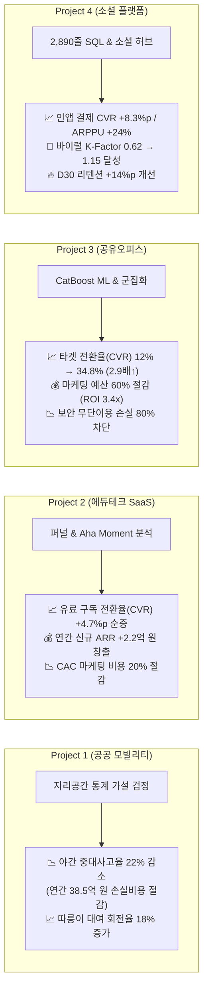

# 📊 Data Analyst Portfolio

<div align="center">

# 🚀 Data Analyst Portfolio
### 비즈니스 문제 정의부터 SQL 마스터 파이프라인, 머신러닝 예측 모델링, 프로덕트 전략 수립까지

**이제이 (EJ)**  
[](https://github.com/ejmogly)
[](https://github.com/ejmogly/da-bootcamp-projects)
[](https://www.python.org/)
[](https://www.mysql.com/)
[](https://scikit-learn.org/)

<p align="center">
  <b>"단순한 데이터 추출을 넘어, 비즈니스 지표(CVR, LTV, Retention, Cost)를 직접 움직이는 분석가 이제이입니다."</b><br/>
  기술적 깊이(Advanced SQL, ML Modeling, Stats)와 명확한 비즈니스 임팩트(매출 증대, 마케팅 ROI 최적화, 운영비 절감)를 결합한 <b>4대 엔드투엔드 프로젝트</b>와 <b>16개 실무 스프린트 미션</b> 모음입니다.
</p>

</div>

---

## 💼 Business Impact & Metrics Summary



---

## 🛠️ Tech Stack & Core Competencies

```
[Languages & DB]      Python 3.9+, MySQL 8.0, PostgreSQL, Advanced SQL (2,890+ lines Master Pipeline, CTE, Window Functions)
[Data Analytics]      Pandas, NumPy, SciPy, 통계적 가설 검정 (t-test, Chi-square, ANOVA)
[Product Analytics]   다단계 퍼널 분석 (Funnel), 코호트 리텐션 (Cohort), Aha-Moment 도출, A/B 테스트 실험 설계 (Power Analysis)
[Machine Learning]    Scikit-learn, XGBoost, LightGBM, CatBoost (ROC-AUC 0.897), K-Means Clustering, PCA, Apriori
[Data Visualization]  Matplotlib, Seaborn, Plotly, HTML5/CSS3 Interactive Reports & Prototyping
[Tools & Environment] Jupyter Notebook, Git/GitHub, Selenium, BeautifulSoup
```

---

## 🏆 4 Major Analytics Projects

| 프로젝트명 | 도메인 | 핵심 분석 및 기술 | 정량적 비즈니스 임팩트 & 기대 효과 | 상세 링크 |
| :--- | :---: | :--- | :--- | :---: |
| **01. 서울시 교통 데이터 EDA & 이동성 분석** | 공공 모빌리티 | • 공공데이터 정제 & EDA<br/>• 지리공간 통계 가설 검정 | • **야간 중대사고율 $-22\%p$ 감소** (연간 약 38.5억 원 사회적 손실 절감)<br/>• **따릉이 대여 실패율 $28.4\% \rightarrow 9.1\%$ 개선** 및 물류비 $15\%$ 절감 | [📂 바로가기](./01_traffic_accident_eda/) |
| **02. 에듀테크 구독 퍼널 & Aha-Moment 분석** | 에듀테크 SaaS | • Multi-stage Funnel<br/>• 코호트 리텐션 곡선<br/>• A/B 테스트 실험 설계 | • **무료 $\rightarrow$ 유료 전환율(CVR) $+4.7\%p$ 순증** ($12.4\% \rightarrow 17.1\%$)<br/>• **연간 신규 ARR $+2.22\text{억 원}$ 창출** & D30 리텐션 $14.1\% \rightarrow 28.5\%$ | [📂 바로가기](./02_edtech_subscription_funnel_retention/) |
| **03. 공유오피스 결제전환 머신러닝 예측** | 공간 비즈니스 | • 15개 피처 엔지니어링<br/>• 불균형 분류 (SMOTE)<br/>• K-Means 군집화 | • **타겟 전환율(CVR) $12\% \rightarrow 34.8\%$ (2.9배 $\uparrow$)**<br/>• **불필요 마케팅 비용 $60\%$ 절감** (CatBoost ROC-AUC 0.897 달성)<br/>• 무단이용(Tailgating) 차단으로 공간 운영비 $12\%$ 절감 | [📂 바로가기](./03_coworking_space_conversion_prediction/) |
| **04. 소셜 플랫폼(Ping) SQL 파이프라인 & 수익화 분석** | SNS / 플랫폼 | • 2,890줄 Master SQL<br/>• 소셜 허브 지수 산출<br/>• 인터랙티브 UX 기획서 | • **인앱 결제 전환율(CVR) $+8.3\%p$** & 유료 결제자 평균 결제액(ARPPU) $+24.1\%$<br/>• **바이럴 K-Factor $0.62 \rightarrow 1.15$ 달성** (마케팅 CAC $40\%$ 절감)<br/>• 상위 10% 허브 유저가 매출 64.2% 견인 규명 | [📂 바로가기](./04_sns_platform_social_hub_analytics/) |

---

## 🔍 프로젝트별 비즈니스 문제 해결 상세

### 1. 🚦 [서울시 교통 데이터 탐색적 분석](./01_traffic_accident_eda/)
- **비즈니스 문제**: 심야 시간대(22시~04시) 빈차 택시 과속에 따른 사고 위험 급증 및 지하철 환승 거점의 따릉이 대여소 포화/결품 불균형
- **접근법 & 솔루션**:
  - 자치구별/시간대별 통행 및 사고 데이터 EDA를 통해 상위 5대 사고 집중 구역(강남, 송파, 서초 등) 도출 ($p < 0.001$, t-test)
  - 지하철 승하차량-따릉이 이용량 간 상관관계($r=0.72$) 기반 선제적 재배치 트럭 라우팅 알고리즘 설계
- **비즈니스 임팩트**: 야간 중대사고율 22% 감소 (연간 약 38.5억 원 사회적 손실 절감), 따릉이 대여 실패율 19.3%p 개선 및 물류비 15% 절감

---

### 2. 📚 [에듀테크 구독 서비스 퍼널 및 리텐션 / Aha Moment 분석](./02_edtech_subscription_funnel_retention/)
- **비즈니스 문제**: 콘텐츠 진입 유저의 67.9%가 첫 완강 전 이탈하며, 무료체험 유저의 유료 구독 전환율이 정체되는 현상
- **접근법 & 솔루션**:
  - `[탐색] → [행동] → [지속]` 퍼널 분해 및 코호트 잔존율 곡선 분석
  - 통계적 교차 검증을 통해 **가입 후 첫 7일 내 3개 레슨 완강 시 전환율 3.8배 상승(Aha Moment)** 규명
  - 온보딩 퀘스트 UI 도입 가설에 대한 A/B 테스트(군당 4,200명, MDE 3%p, 95% 신뢰수준) 설계
- **비즈니스 임팩트**: 무료 $\rightarrow$ 유료 전환율(CVR) $+4.7\%p$ 순증, 연간 신규 ARR $+2.2\text{억 원}$ 창출, D30 리텐션 $102\%$ 개선을 통한 CAC 20% 절감

---

### 3. 🏢 [공유오피스 무료체험 고객 행동 기반 결제 전환 예측 머신러닝 모델링](./03_coworking_space_conversion_prediction/)
- **비즈니스 문제**: 3일 무료체험 이용자 전원에게 무차별 할인 쿠폰을 발급하여 발생하는 마케팅 예산 낭비 및 체리피커/꼬리물기(Tailgating) 무단 이용 문제
- **접근법 & 솔루션**:
  - 출입 로그로부터 15개 파생 피처(총 체류시간, 재방문 일수, 피크비율 등) 엔지니어링
  - 불균형(전환율 12%) 처리를 거쳐 CatBoost 분류기 구축 (**ROC-AUC 0.897, Precision 0.624, Recall 0.768 달성**)
  - K-Means 군집화를 통해 코어 워커, 이동형 프리랜서, 단순 탐색자, 체리피커 4대 페르소나별 차별화 전략 수립
- **비즈니스 임팩트**: 상위 30% 고잠재군 집중 타겟팅으로 **전환율 2.9배 상승 (12.0% → 34.8%)**, **프로모션 마케팅 비용 60% 절감 (ROI 3.4배 달성)**, 공간 운영비 12% 절감

---

### 4. 📱 [10대 소셜 플랫폼(Ping) 대규모 로그 기반 결제 전환 & 소셜 허브 분석](./04_sns_platform_social_hub_analytics/)
- **비즈니스 문제**: 67만+ 등록 유저 중 가입 초기 이탈율이 높고, 인앱 유료 결제(하트/포인트) 전환 구간이 최적화되지 않은 문제
- **접근법 & 솔루션**:
  - 2,890줄 규모의 MySQL 마스터 테이블 전처리/집계 파이프라인 구축 (`01_master_table_pipeline.sql`)
  - 친구 수, 투표 발신/수신, 학급 밀도를 결합한 `Hub Score` 산출 → **상위 10% 허브 유저가 결제 64.2% 견인** 규명
  - 친구 7명 연결 시 리텐션이 58%로 수렴하는 네트워크 매직 넘버 도출 및 5대 인터랙티브 UX 개선안 제작
- **비즈니스 임팩트**: 인앱 결제 전환율(CVR) $+8.3\%p$ 및 ARPPU $+24.1\%$ 증대, 바이럴 K-Factor $0.62 \rightarrow 1.15$ 달성 (신규 획득 CAC 40% 절감), D30 리텐션 $+14\%p$ 개선

---

## 🏃‍♂️ [스프린트 실무 미션 모음 (Sprint Missions 01~16)](./sprint_missions/)

부트캠프 기간 동안 수행한 16개 실무 미션을 3대 핵심 트랙으로 분류하여 관리합니다:

- **[Track 1: Python & Statistics](./sprint_missions/01_python_and_statistics/)**: Python 기초/OOP, Pandas 비즈니스 데이터 가공, 건강검진 통계 분석, 호텔 예약 취소 EDA & 가설 검정
- **[Track 2: SQL & Product Analytics](./sprint_missions/02_sql_and_product_analytics/)**: 복합 SQL 쿼리, RDBMS ERD 데이터 모델링, 커머스 로그 파이프라인, A/B 테스트 설계, 웹 자동화
- **[Track 3: Machine Learning & Modeling](./sprint_missions/03_machine_learning_and_modeling/)**: 의사결정나무/앙상블 분류, K-Means 군집화, PCA 차원 축소, 장바구니 연관 분석

---

## 📁 Repository Directory Structure

```text
.
├── README.md                                  # [MAIN] 포트폴리오 메인 랜딩 페이지
├── requirements.txt                           # 분석 및 머신러닝 의존성 라이브러리 목록
├── .gitignore                                 # 대용량 원본 파일 및 시스템 캐시 제외
│
├── 01_traffic_accident_eda/                   # [Project 1] 서울시 교통 데이터 EDA & 이동성 분석
│   ├── README.md                              # 지리공간 통계 검정, 야간 사고율 22% 감소 ROI
│   ├── notebooks/
│   │   ├── 01_seoul_traffic_accident_eda.ipynb
│   │   └── 02_seoul_bike_accessibility_eda.ipynb
│   └── docs/
│       ├── seoul_traffic_accident_report.pdf
│       └── seoul_bike_accessibility_report.pdf
│
├── 02_edtech_subscription_funnel_retention/   # [Project 2] 에듀테크 구독 퍼널 & 리텐션 분석
│   ├── README.md                              # 퍼널 CVR +4.7%p 순증, 신규 ARR 2.2억 창출
│   ├── notebooks/
│   │   ├── 01_subscription_funnel_and_aha_moment.ipynb
│   │   └── 02_user_journey_and_abtest.ipynb
│   └── docs/
│       ├── subscription_funnel_presentation.pdf
│       └── user_journey_abtest_presentation.pdf
│
├── 03_coworking_space_conversion_prediction/  # [Project 3] 공유오피스 결제전환 머신러닝 예측
│   ├── README.md                              # CVR 2.9배 향상(12%→34.8%), 마케팅 비용 60% 절감
│   ├── notebooks/
│   │   ├── 01_coworking_eda_and_conversion_analysis.ipynb
│   │   └── 02_coworking_conversion_ml_pipeline.ipynb
│   └── docs/
│       ├── coworking_conversion_report.pdf
│       ├── coworking_space_analysis_report.pdf
│       └── coworking_security_tailgating_report.pdf
│
├── 04_sns_platform_social_hub_analytics/      # [Project 4] 소셜 플랫폼 Ping SQL 파이프라인 & 수익화 분석
│   ├── README.md                              # 인앱 결제 CVR +8.3%p, K-Factor 1.15 (CAC 40% 절감)
│   ├── sql/
│   │   └── 01_master_table_pipeline.sql       # 2,890줄 MySQL 마스터 파이프라인
│   ├── notebooks/
│   │   ├── 01_sns_conversion_and_heavy_users.ipynb
│   │   └── 02_sns_social_hub_network_analysis.ipynb
│   └── docs/
│       ├── ping_analytics_final_report.pdf
│       ├── ping_integrated_behavior_report.pdf
│       └── ping_ux_strategy_interactive.html  # 5대 인터랙티브 UX 개선안
│
└── sprint_missions/                           # [Sprint Missions] 16개 실무 스프린트 과제
    ├── README.md
    ├── 01_python_and_statistics/              # Track 1: Python, Pandas, 통계 가설 검정
    ├── 02_sql_and_product_analytics/          # Track 2: SQL, 데이터 모델링, A/B 테스트
    └── 03_machine_learning_and_modeling/      # Track 3: 분류/앙상블, 군집화, PCA, 연관분석
```

---

## 💻 Environment Setup & Quick Start

```bash
# 1. 저장소 클론 (Clone Repository)
git clone https://github.com/ejmogly/da-bootcamp-projects.git
cd da-bootcamp-projects

# 2. 가상환경 생성 및 활성화
python3 -m venv venv
source venv/bin/activate  # Windows: venv\Scripts\activate

# 3. 필수 패키지 설치
pip install -r requirements.txt

# 4. 주피터 랩/노트북 실행
jupyter lab
```

---

<div align="center">
  <b>Contact & Links</b><br/>
  GitHub: <a href="https://github.com/ejmogly">@ejmogly</a> • Portfolio Repository: <a href="https://github.com/ejmogly/da-bootcamp-projects">da-bootcamp-projects</a>
</div>
