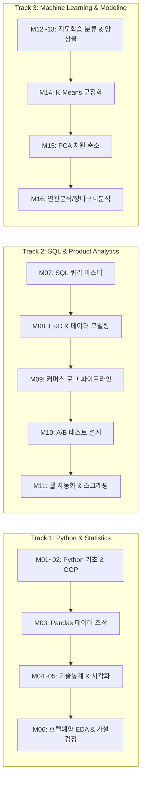

# 🏃‍♂️ Sprint Missions: 데이터 분석 실무 스프린트 과제 모음 (Sprint Missions 01~16)

> **작성자**: 이제이 ([@ejmogly](https://github.com/ejmogly))  
> **목적**: 부트캠프 기간 동안 수행한 16개 실무 중심 스프린트 미션을 3개 핵심 역량 트랙(Python/통계, SQL/프로덕트, 머신러닝)으로 구조화하여 기초 체력과 문제 해결 역량을 입증  

---

## 🗺️ 스프린트 미션 로드맵 (Curriculum & Skill Matrix)

---

## 📂 트랙별 상세 내용 및 파일 목록

### 🐍 Track 1: Python 프로그래밍 & 기초 통계 가설 검정 (`01_python_and_statistics/`)
- [`mission01_python_fundamentals.ipynb`](file:///Users/ejay/Downloads/code/da_bootcamp/sprint_missions/01_python_and_statistics/mission01_python_fundamentals.ipynb): Python 자료형, 제어문, 리스트 컴프리헨션 및 알고리즘 구현
- [`mission02_python_oop_and_functions.ipynb`](file:///Users/ejay/Downloads/code/da_bootcamp/sprint_missions/01_python_and_statistics/mission02_python_oop_and_functions.ipynb): 함수 모듈화, 클래스 및 객체지향(OOP) 데이터 분석 파이프라인
- [`mission03_pandas_business_data.ipynb`](file:///Users/ejay/Downloads/code/da_bootcamp/sprint_missions/01_python_and_statistics/mission03_pandas_business_data.ipynb): Pandas를 활용한 급여 데이터 가공, 인덱싱 및 집계 연산
- [`mission04_05_health_stats_visualization.ipynb`](file:///Users/ejay/Downloads/code/da_bootcamp/sprint_missions/01_python_and_statistics/mission04_05_health_stats_visualization.ipynb): 건강검진 공공데이터 기반 기술통계량 산출, 상관분석 및 다차원 시각화
- [`mission06_hotel_booking_eda_hypothesis.ipynb`](file:///Users/ejay/Downloads/code/da_bootcamp/sprint_missions/01_python_and_statistics/mission06_hotel_booking_eda_hypothesis.ipynb): 호텔 예약 취소 데이터 EDA, 리드타임/고객 세그먼트별 취소율 통계 가설 검정

---

### 💾 Track 2: SQL 데이터 추출, 모델링 & 프로덕트 분석 (`02_sql_and_product_analytics/`)
- [`mission07_sql_queries.sql`](file:///Users/ejay/Downloads/code/da_bootcamp/sprint_missions/02_sql_and_product_analytics/mission07_sql_queries.sql): 복합 Join, 서브쿼리, 윈도우 함수(`ROW_NUMBER`, `LEAD/LAG`, `SUM OVER`) 실습
- [`mission08_data_modeling.txt`](file:///Users/ejay/Downloads/code/da_bootcamp/sprint_missions/02_sql_and_product_analytics/mission08_data_modeling.txt): 관계형 데이터베이스(RDBMS) 정규화(1NF~3NF) 및 ERD 관계 설계
- [`mission09_sql_data_pipeline.ipynb`](file:///Users/ejay/Downloads/code/da_bootcamp/sprint_missions/02_sql_and_product_analytics/mission09_sql_data_pipeline.ipynb): 이커머스 유저 주문 및 행동 로그 집계 파이프라인
- [`mission10_ab_test_design.ipynb`](file:///Users/ejay/Downloads/code/da_bootcamp/sprint_missions/02_sql_and_product_analytics/mission10_ab_test_design.ipynb): 프로덕트 개선을 위한 A/B 테스트 실험 가설 수립, MDE/표본 크기 산출 및 사후 검정
- [`mission11_web_automation.ipynb`](file:///Users/ejay/Downloads/code/da_bootcamp/sprint_missions/02_sql_and_product_analytics/mission11_web_automation.ipynb): 웹 크롤링 및 데이터 수집 자동화 스크립트

---

### 🤖 Track 3: 머신러닝 알고리즘 & 비즈니스 모델링 (`03_machine_learning_and_modeling/`)
- [`mission12_13_classification_and_ensemble.ipynb`](file:///Users/ejay/Downloads/code/da_bootcamp/sprint_missions/03_machine_learning_and_modeling/mission12_13_classification_and_ensemble.ipynb): 고객 이탈 및 구매 전환 예측을 위한 의사결정나무(Decision Tree)와 앙상블(Random Forest, XGBoost) 모델링
- [`mission14_kmeans_clustering.ipynb`](file:///Users/ejay/Downloads/code/da_bootcamp/sprint_missions/03_machine_learning_and_modeling/mission14_kmeans_clustering.ipynb): K-Means 알고리즘 및 엘보우(Elbow) 기법을 활용한 고객 행동 군집화
- [`mission15_pca_dimensionality_reduction.ipynb`](file:///Users/ejay/Downloads/code/da_bootcamp/sprint_missions/03_machine_learning_and_modeling/mission15_pca_dimensionality_reduction.ipynb): 주성분 분석(PCA) 기반 고차원 피처 차원 축소 및 분산 설명력 분석
- [`mission16_market_basket_analysis.ipynb`](file:///Users/ejay/Downloads/code/da_bootcamp/sprint_missions/03_machine_learning_and_modeling/mission16_market_basket_analysis.ipynb): Apriori 알고리즘 기반 지지도(Support), 신뢰도(Confidence), 향상도(Lift) 연관 규칙 도출
